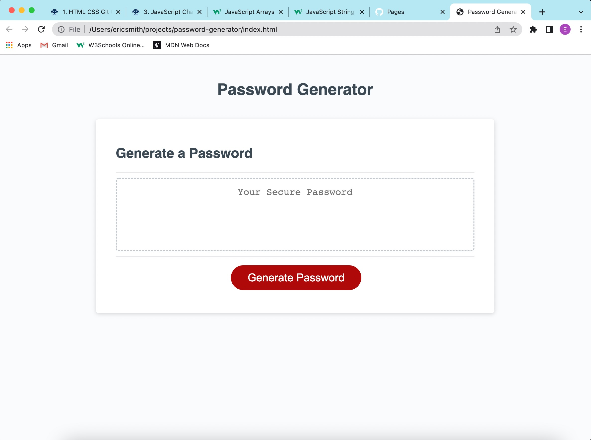

# password-generator

Pressing the generate password button allows the user to choose the length of the password, as well as the types of characters the password will consist of.

The password will generate in the text field.

If no length for the password is specified, the user will be prompted to try again.

If the password length specified is less than eight characters, the user will be prompted to try again.

If the password length specified is greater than one-hundred-twenty-eight characters, the user will be prompted to try again.

Finally, if the user fails to request the use of any types of characters for the password, the user will be prompted to try again.

https://github.com/frodrickfronkenstein/password-generator